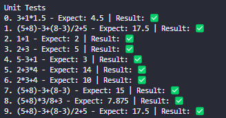

# AllMediaDesk Test
This repository has 3 challenges for the AllMediaDesk test

### Part 1 - Calculator that accepts math expressions
Develop a term calculator that can handle (), *, /, +, and -.

Run tests inside the folder part1
```
node .\index.js --debug=false --tests=true
```

Run math expression inside the folder part1
```
node .\index.js --expression="(5+8)-3+(8-3)" --debug=false
```

### Part 2 - Peter meditation Number
Peter likes numbers. As a meditation exercise, he likes to write down all the numbers starting with 1
whose digits are sorted in ascending order

Run tests inside the folder part2
```
node .\index.js --tests=true
```

Get Peter meditation number inside the folder part2
```
node .\index.js --number=12345673221
```

### Part 3 - Graph with cartesian plane (Based in calculator)
Allow the term calculator to accept lines in the form y = <TERM> with x as an additional possible
character in the term. If such a complete equation is given, you display a simple x / y graph

**I choose make the project with ReactJS, the build is ready to run, and I left the file index.html appinted to build file**

If you want start the project, you can use:

1. Go to inside the folder part3/cartesian-plane/

2. Install dependencies
```
yarn
```

3. Start the project
```
yarn start
```

Extras:

Img tests in part 1:



<hr />

Img tests in part 2:


<hr />

Img gaph in part 3:

